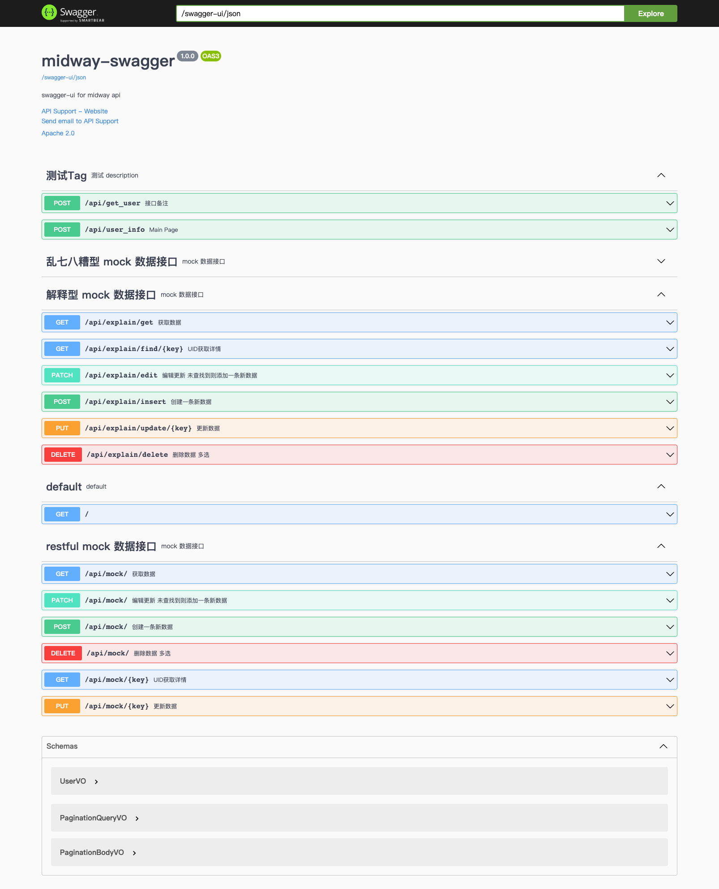

# mamba [集合框架解决方案] 
## 文档
[https://lengyxin.github.io/mamba/](https://lengyxin.github.io/mamba/)
## 启动

```bash
# clone --depth=1 不需要提交记录
git clone https://github.com/LengYXin/mamba.git --depth=1 

# 安装lerna 全局
npm i -d -g lerna

# 安装依赖
yarn 

# 开始开发
yarn run dev

# 构建
yarn run build
```
## 架构


## server [mock 服务 (用于API规范)]


### API 规范

> 查询列表数据 【 method: get | post 】 (分页|瀑布流) 二合一

  ``` ts 
  // 示例: 【get】 /v1/user

  //  入参 
  {
     // 当前页码 非必填  默认1
     "current":1,    
     // 每页条数 非必填  默认15
     "pageSize":15,  
     // 搜索条件 非必填 string|object   string=模糊搜索 object 按字段条件搜索
     "search":{},
     // 排序 非必填 [{name:'',sort:'asc'|'desc'}]
     "sort":[{"name":"age","sort":"asc"}],
     // 最后一天数据的 非必填 uuid 用于瀑布流
     "lastKey":"id"
  }

  // 出参

  // 分页
  {
    // 同入参
    "current": 1,
    // 同入参
    "pageSize": 15,
    // 当前条件下数据总数
    "total": 99,
    // 数据集
    "dataSource": [],
  }

  // 瀑布流 直接返回 数据集 或者 上面分页类型
  [....]
  ```


> 查询单条数据 【 method: get 】 

  ``` ts 
  // 示例: 【get】 /v1/user/123

  //  入参 url 中的 id
  // 出参
    {
      "id":"123",
      "name":"用户姓名"
    }

  ```

> 创建新数据 【 method: post 】
  + 入参 body 体 object
  + 出参 当前创建的新数据实体
  ``` ts 
  // 示例: 【post】 /v1/user
  
  //  入参 
  {
     "name":"用户姓名"
  }

  // 出参
  {
    "id":"123",
     "name":"用户姓名"
  }
  ```
  
> 修改编辑数据 【 method: put 】
  + 入参 body 体 object
  + 出参 当前创建的新数据实体
 ``` ts 
  // 示例: 【put】 /v1/user/{id}
  
  //  入参 
  {
    "id":"123",
     "name":"用户姓名"
  }

  // 出参
  {
    "id":"123",
     "name":"用户姓名"
  }
  ```
> 删除数据 【 method: delete 】
  + 入参 body 体 Array<string>
  + 出参 布尔类型
 ``` ts 
  // 示例: 【delete】 /v1/user
  
  //  入参 
  [1,2,3]

  // 出参
  true | false
  ```

  #### 其他事项
  > 数据类型
  * 时间类参数 出参数&入参统一使用 【时间戳】  格式化显示前端自己处理 （不使用时间戳 会存在 uct 等误差）
  * 请求出错 使用 http 状态码
  * 业务错误 返回
  ``` ts
  {
    "errorCode": 1,
    "message": "没有找到对应的数据",
  }
  ```


